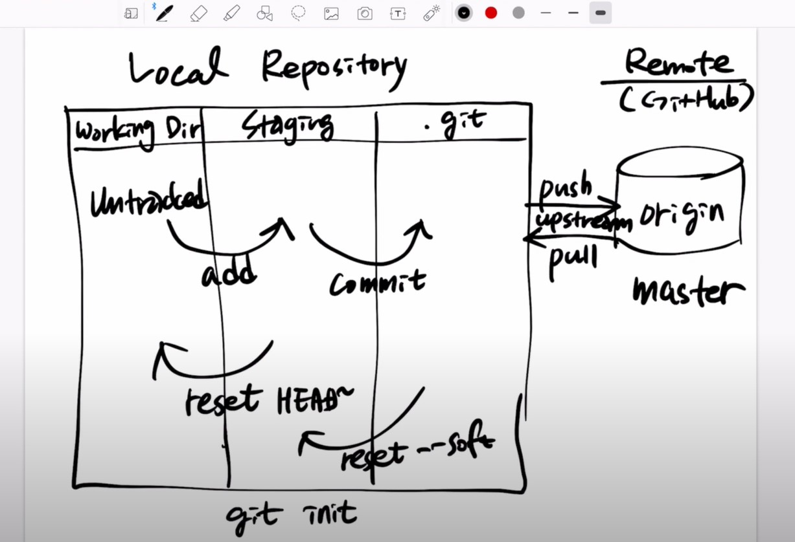

# git 간단 사용법



## HEAD

```bash
git log HEAD^ #직전 해쉬
git log HEAD^^ # 다다음 해쉬

git log HEAD~ # 직전 해쉬
git log HEAD~1 # 디다음 해쉬

```

## 깃 최초설정

```bash
git init # git 설정파일을 만들어주는 명령어
```

## 깃 스테이지 추가

```bash
git add [파일명] # 커밋 스테이지에 각각 추가하는 명령어

git add . # 변경된 파일들 전부 추가하는 명령어
```

## 깃 커밋

```bash
git commit -m "커밋 메시지 적는 곳"  # 파일이나 디렉토리의 변경내용을 저장소에 기록하는 것
```

## 원격저장소 연결

```bash
git remote add [name] [git 주소] # 해당 파일들을 연동할 원격지의 주소 지정

git remote rm [name] # 연동할 원격지 삭제.

git remote update origin --prune # 오리진 브랜치 업데이트
```

## 원격저장소에 파일 보내기

```bash
git push -u origin master # -u 는 --set-upstream을 한번에 적어주는 명령어.

git push # 위의 명령어로 푸쉬 되었다면 그 다음부터는 요 명령어만 적어도 push
```

## 원격저장소에서 받기

```bash
git pull # 원격저장소에 저장된 내용을 내려받는다.
```

## 깃 브랜치(가지치기)

```bash
git branch # 브랜치 목록보기

git branch [브랜치명] # 해당 브랜치를 만든다

git branch -d [브랜치명] # 해당 브랜치를 삭제한다 만약 머지하지 않은게 있다면 에러 출력

git branch -D [브랜치명] # 해당 브랜치를 강제삭제한다(머지 하던말건 삭제)
```

## 깃 브랜치간의 이동

```bash
git checkout [브랜치명] # 해당 브랜치로 이동한다

git checkout - # 이전 브랜치로 이동

git checkout -b [생성할 브랜치명] [참조 브랜치명] # 해당 브랜치를 만들고 바로 이동한다

git checkout -p [브랜치명] [특정 파일] 합치기

```

## 브랜치 병합

```bash
git merge [브랜치명] # 지금 체크아웃한 브랜치에 [브랜치명]을 병합한다.

git merge --no-ff [브랜치명] # fast forward 안하겠다
```

## 깃 상태 및 이력

```bash
git status # 깃 상태를 확인

git log -n 10 # 깃 커밋 이력을 확인 -n으로 이력의 갯수를 정할 수 있다.
```

## 깃 검색

```bash
git grep "검색단어" # 저장소의 파일내용에서 검색하고자 할 때 사용
```

## 커밋 되돌리기

```bash
git reflog # 변경내용 head 확인

git reset [--soft//--hard] "커밋id" # 로컬저장소에 커밋을 취소할 때 사용.
--soft # 복구된 이력 이후 내용 모두 유지 staging 유지
--mix(default) #  복구된 이력 이후 내용 모두 유지하지만 변경내용 초기화 unStaging
--hard # 복구된 이력 이후 내용 모두 삭제 및 초기화 (주의) # 다 날라감
```

## push 되돌리기

```bash
git revert "커밋id" # 로컬저장소에 커밋을 취소할 때 사용.
```

## 원격저장소에서 통째로 가져오기

```bash
git clone [url] # 저장소를 클론 받기.
```

## 작업 임시저장 stash

```bash
git stash save <stash-name>
git stash save -u <stash-name> # 새로만든 파일까지 같이 저장

git stash list

git stash pop # 가장 최근 stash 적용 (적용된 stash는 list에서 사라짐)

git stash apply <stash-name> # 가장 최근 stash 적용 (적용된 stash는 남아있음)

```

## rebase

```bash

git rebase drop # 해당 소스(commit) 삭제

git rebase fixup # 바로 앞 으로 합치기

git rebase squash # 바로 앞을 최신으로 합치기

### 커밋 메시지 바꾸고 싶을때는 squash, 유지하고자 할때는 fixyp

```

출처: https://niceman.tistory.com/187

https://tagilog.tistory.com/377

https://wit.nts-corp.com/2014/03/25/1153
