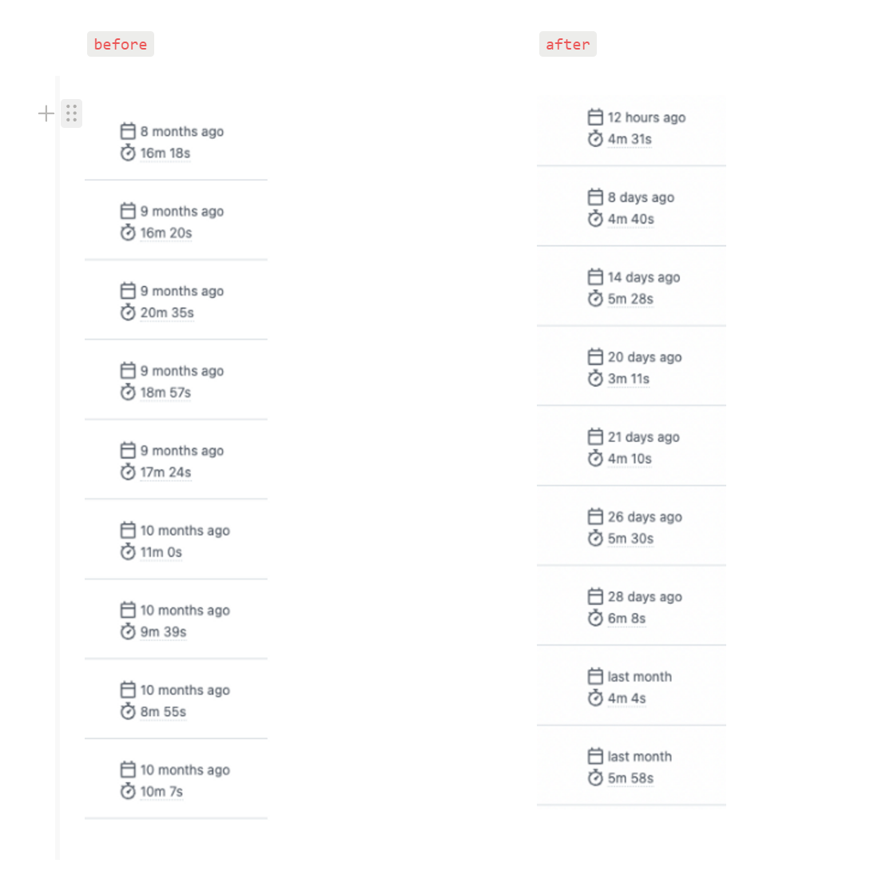

안녕하세요. 볼드나인 프론트엔드 개발자 김정수입니다.

오늘은 webpack에서 `vite로 마이그레이션` 하고 변경된 번들러로 production 빌드를 경험했던 내용들을 공유하고자 합니다!

## Webpack을 바꾸게 된 이유

기존 cra로 작성되어 있는 프로젝트가 개발환경에서 dev server를 켜는것도 시간이 오래걸리고,

무엇보다 빌드시간이 `8분에서 20분까지`편차가 너무 심했습니다.

빌드시간이 느리다는 것은 핫픽스되어야 할 PR을 테스트하고 빌드되는 시간동안 PR에 관련된 모든 사람들의 시간이 낭비되고 있다는 뜻이고

불필요한 시간들을 줄이고자 [craco](https://www.npmjs.com/package/@craco/craco)를 사용하여 [craco-esbuild](https://www.npmjs.com/package/craco-esbuild)를 사용하였으나

속도가 드라마틱하게 개선되지 않았고, svg 깨짐 관련 이슈가 있었기 때문에

한번의 시행착오를 겪고 개선할 수 있는 방법을 찾아 나서게 되었습니다.

## Vite를 선택한 이유

Vue3를 공부하고 있던 시점에 [Vite](https://vitejs.dev/)라는 번들러를 사용하였는데 매우 빠른속도로 인상깊었던 경험을 바탕으로 공식문서를 보게되었습니다.

먼저 개발환경에서만 사용을 하였으나 (빠른 초기 로딩, hmr 적용)

build시에 [rollup](https://rollupjs.org/guide/en/)을 사용하여 속도와 안정성 두마리를 잡을 수 있다는 공식문서대로

production 빌드시에도 사용해보고 싶은 욕심이 생겨 선택하였습니다.

## Vite가 어떤 방식을 사용해 빌드시간을 단축했을까?

[build minify](https://vitejs.dev/config/build-options.html#build-minify)의 옵션을 보게되면 [esbuild](https://esbuild.github.io/)에 대해 설명합니다.

[esbuild](https://esbuild.github.io/)는

- **네이티브 코드로 컴파일되는 “Go” 언어로 작성되었습니다.**
- **코드 파싱, 출력과 소스맵 생성을 모두 병렬로 처리합니다.**
- **불필요한 데이터 변환과 할당이 없습니다.**

이러한 방식으로 최대 100배에 가까운 속도를 낼 수 있다고 명시되어 있습니다.

여러가지 번들러의 벤치마킹 결과를 볼 수 있는 깃허브 페이지 입니다.

[https://github.com/privatenumber/minification-benchmarks](https://github.com/privatenumber/minification-benchmarks)

## ✅ 얼마나 개선되었을까?

- hmr 속도

  - **[@vitejs/plugin-react](https://github.com/vitejs/vite-plugin-react)** 사용하여 dev server에서 정말 빠른속도로 변경된 부분만 변경시켜줍니다.
  - Vite 4버전에서 추가된 https://github.com/vitejs/vite-plugin-react-swc를 사용하면 더욱 더 빠른 속도를 경험할 수 있다고 합니다.

- 빌드 시간 비교

  - **Webpack** → 평균 `10분`
  - **Vite** → 40 ~ 60초 평균 `50초`

- 번들 용량 비교([gzip](https://ko.wikipedia.org/wiki/Gzip)적용 전 기준)
  - **Webpack** 번들 크기 약 `11mb`
  - **Vite** 번들 크기 약 `6mb`

용량이 반정도 줄었지만 여전히 6mb라는 결과물은 만족스럽지 못한 결과였습니다.

번들 용량을 줄이는것이 프론트엔드 개발자로서 성능개선을 가장 직관적으로

할 수 있는 방법이라고 생각하였기 때문에 번들의 크기를 줄일 수 있는 방법에 대해 찾다가

nginx에서 압축된 리소스를 파일을 사용할 수 있다고 알게되어 적용을 해보았습니다.

## nginx에서 [gzip](https://ko.wikipedia.org/wiki/Gzip)설정

- nginx 공식 홈페이지 설정 docs
  - [http://nginx.org/en/docs/http/ngx_http_gzip_module.html](http://nginx.org/en/docs/http/ngx_http_gzip_module.html)

## Vite와 gzip적용 후

- 빌드 타임 평균 10분 → `4분`
- 번들 리소스 11mb -> `1.8mb`

## ⚠️마이그레이션 중 맞닥드린 문제들

### 타입스크립트 체크는 어떻게?

- Vite는 dev server 및 build 실행시 타입스크립트 체크를 하지 않습니다.
- dev
  - tsc -w로 타입검사를 watch 하는 방법
    - [vscode run task로 tsc -w 자동화 하기](https://code.visualstudio.com/docs/editor/tasks)
    - 웹에서 에러부분을 시각적으로 표시해주지는 않습니다
  - Vite 플러그인을 사용하는 방법
    - https://github.com/fi3ework/vite-plugin-checker dev server 작동시 타입 체크를 해주고 웹에 타입 오류를 표시해줍니다.
- build
  - Vite를 사용한 이유에서도 말씀드렸듯이 빌드 속도에 초점을 맞추기 위해 build시 타입체크를 배제하였습니다.
  - 대신 PR을 올릴때 깃허브 액션으로 preview build와 build, tsc 및 테스트 코드를 병렬로 실행하여 오류코드를 merge하기 전 타입에러가 날 수 있는 상황을 인지할 수 있도록 하였습니다.
    

### [VITE\_접두사](https://vitejs.dev/guide/env-and-mode.html#env-files)

- REACT_APP_GRAPHQL_URL를 VITE_REACT_APP_GRAPHQL_URL처럼 접두사를 붙여
  환경변수를 저장하고 import.meta.env를 사용하여야 합니다.

## 🚧 주의사항

- [최신 브라우저만 지원합니다.](https://vitejs-kr.github.io/guide/migration-from-v2.html#modern-browser-baseline-change)
  - I**E는 지원이 안됩니다.**
  - 이전 브라우저에 대해 지원이 필요하다면 legacy 플러그인을 사용해야 합니다.

- SSR을 완벽하게 지원하지 않습니다.
  - [https://vitejs.dev/guide/ssr.html](https://vitejs.dev/guide/ssr.html)
  - 따라서 SSR이 필요한 경우엔 고려가 필요합니다.

## 마무리

반복작업의 속도를 줄이는 이번 작업으로 인해 생산성이 늘어난 것 같아 개인적으로 뿌듯했던 작업이었습니다.

더 많은 정보를 알아보고 싶은 생각이 드셨다면 [공식문서](https://vitejs.dev/)를 참조하여 적용해보시면 좋을 것 같습니다.

긴 글 읽어주셔서 감사합니다!
